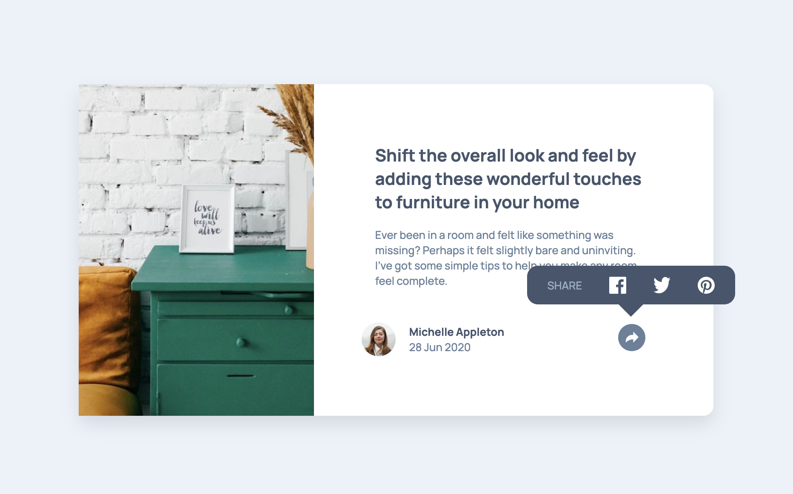

# Frontend Mentor - Article preview component

## 🔗 Live Demo
👉 [View Site](https://bruchno.github.io/article-preview-component/)

## 📁 Repository
🔗 [GitHub](https://github.com/Bruchno/article-preview-component)

## 🛠️ Technologies Used
- **HTML5**
- **CSS3**
- **Vanilla JavaScript** (no external libraries)

## 📌 Features
- Responsive article preview layout
- Interactive "Share" button with animated social icons
- Fully native implementation — no frameworks or libraries
- Lightweight and fast-loading

## ⚠️ External Libraries
This project does **not** rely on any third-party libraries.  
If needed, external resources (icons, fonts, etc.) must be:
- downloaded and included locally, or  
- linked via CDN manually.

This ensures **minimal document weight** and **maximum control**.

## 📷 Screenshot
screenshot.png 

## 📄 License
This project is created for educational purposes.  
Feel free to use, modify, and share without restrictions.
